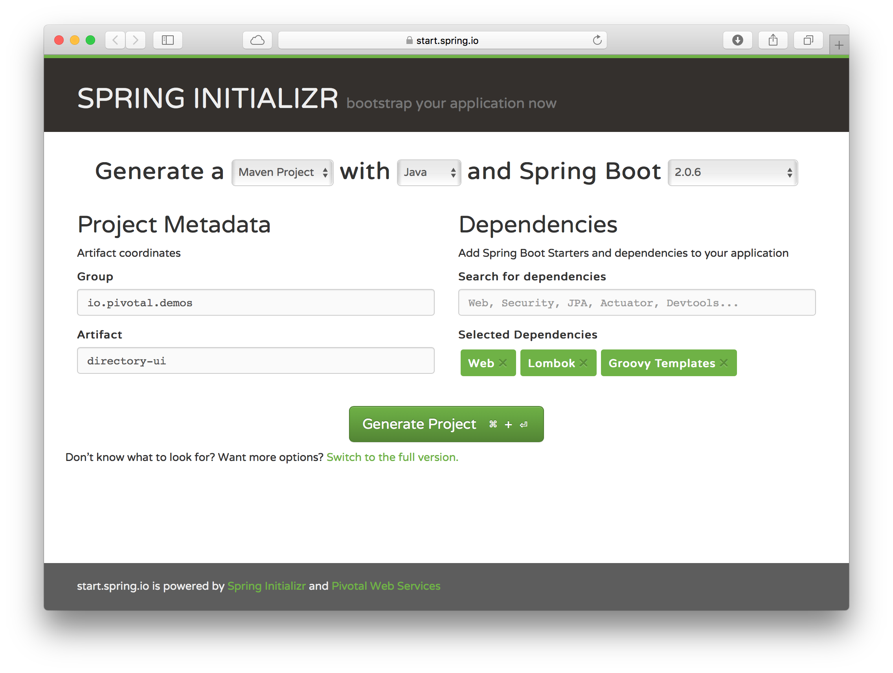
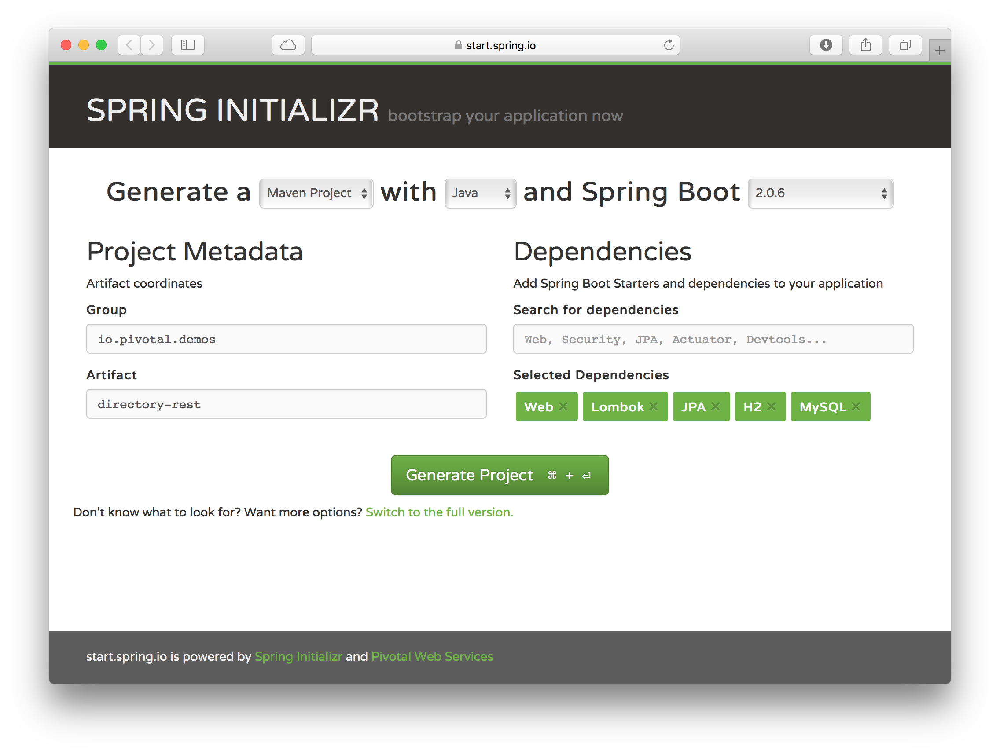
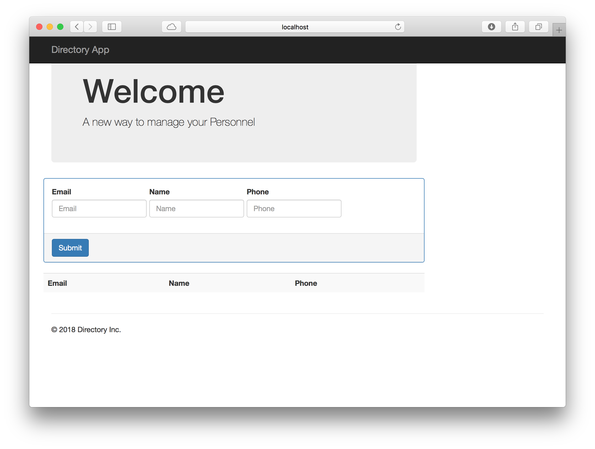
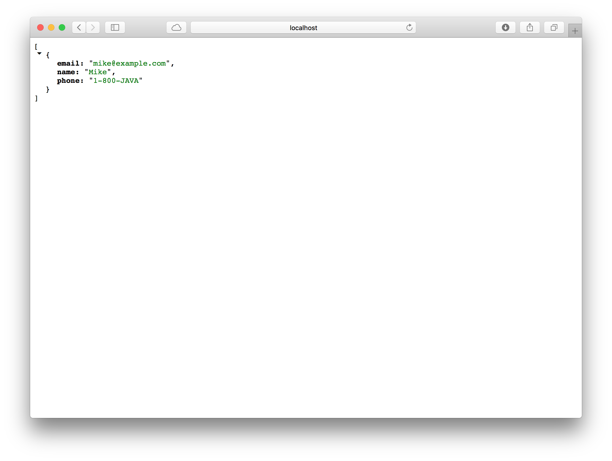

= Deploying Microservices
:docinfo: shared
:toc: macro
:toc-title: Labs
:linkattrs:

The idea of this workshop is to show the differences of using PAS/PKS vs. K8s. This is only for education purpose only.

toc::[]

== Creating Microservices

In this section will cover how to create a complete applicationis from scratch using Java.

=== Directory UI Project

This project will be the Front End that uses a simple form, that will post a JSON to the *_directory-rest_* microservice.

1. Create a project using the Spring Initializr, click https://start.spring.io[,window="_blank"]
2. Use the following information:
+
[cols=">h,5m"]
|===
|Group|io.pivotal.demos
|Artifact|directory-ui
|Dependencies|Web, Lombok, Groovy Templates
|===
+
.Spring Initializr - http://start.spring.io[,window="_blank"]

+
You can choose either Gradle or Maven. Click *_Generate Project_*
3. Unzip and import the project in your favorite IDE.

=== Directory Rest API Project

1. Create a project using the Spring Initializr, click https://start.spring.io[,window="_blank"]
2. Use the following information:
+
[cols=">h,5m"]
|===
|Group|io.pivotal.demos
|Artifact|directory-rest
|Dependencies|Web, Lombok, JPA, H2, MySQL
|===
+
.Spring Initializr - http://start.spring.io[,window="_blank"]

+
You can choose either Gradle or Maven. Click *_Generate Project_*
3. Unzip and import the project in your favorite IDE.

== Using Pivotal Application Service - PAS

In this section will deploy the two apps and conect them together using Pivotal Application Service.

1. You can get an account in https://run.pivotal.io[PWS, window="_blank"] a PAS offering to the public.
2. Once you have you account, you can login with:
+
.Login into PWS
[source,shell]
----
cf login -a api.run.pivotal.io
----
+ 
Use the account you've just created and your password. By default it use the *_Development_* space.

=== Deploying the Directory UI App

1. Package your app. Go to the *_directory-ui_* project and execute the following command:
+
.Creating an UBER jar
[source,shell]
----
./mvnw clean package -DskipTests
----

2. Deploy the generated *directory-ui-0.0.1-SNAPSHOT.jar* by executing the following command:
+
.Deploying the *directory-ui* app. 
[source,shell]
----
cf push directory-ui --random-route -p target/directory-ui-0.0.1-SNAPSHOT.jar -m 756M
----

=== Deploying the Directory Rest App

1. Deploy the *directory-rest* app by executing the following command:
+
.Deploying the *directory-rest* app.
[source,shell]
----
cf push directory-rest --random-route -p target/directory-rest-0.0.1-SNAPSHOT.jar -m 756M
----
2. Create a the MySQL Service
+
.Creating a Service
[source,shell]
----
cf create-service cleardb spark mysql
----
3. Bind the Service to the *directory-rest* app.
+
.Service binding
[source,shell]
----
cf bind-service directory-rest mysql
----
4. Restage

=== Connecting the Directory UI and Rest

If you go to the *_directory-ui_* app url, you will see that is empty because the *directory.service-uri* still is pointing to the *_localhost:9090_*.
How can we make them talk together. There are several ways:

- You can _hardcode_ the name of the *_directory-rest_* URL and re-deploy it.
- You can use an _Environment Variables_.

Let's use the _Environment Variables_ approach.

1. Add the following environment variable to the *_directory-ui_* app using the following command:
+
.Environment Variables with PCF
[source,shell]
----
cf set-env directory-ui DIRECTORY_SERVICE_URI <directory-rest url with /persons> 
----

2. Restart the app so the environment variable take effect.
+
.Restart App
[source,shell]
----
cf restart directory-ui 
----

3. Now, you can refresh your app and see it working.

== Using Kubernetes

Assuming you have Docker installed in your machine and access to a Kubernetes cluster. You can use https://kubernetes.io/docs/setup/minikube/[minikube, window="_blank"]

=== Creating a Docker image for the Directory UI app

1. Package your app. Go to the *_directory-ui_* project and execute the following command:
+
.Creating an UBER jar
[source,shell]
----
./mvnw clean package -DskipTests
----

2. Create the following *Dockerfile* in the root of the project:
+
.Dockerfile
[source,docker]
----
FROM openjdk:8-jdk-alpine
VOLUME /tmp
COPY target/directory-ui-0.0.1-SNAPSHOT.jar app.jar
EXPOSE 8080
ENTRYPOINT ["java","-Djava.security.egd=file:/dev/./urandom","-jar","/app.jar"]
----

3. Build the Docker image with:
+
.Building the Docker image
[source,shell]
----
docker build -t directory-ui .
----

4. Test the Docker image with:
+
.Testing the Docker image
[source,shell]
----
docker run -d -p 8080:8080 --name directory-ui directory-ui
----
+
Go to the browser to http://localhost:8080[^]

+
As you can see there is no people listed. Will fix this later.

5. You can stop and remove the app with:
+
.Removing the Docker image
[source,shell]
----
docker rm -f directory-ui
----

=== Using a Docker image for MySQL

1. Test the image by pulling it from DockerHub
+
.Using the https://hub.docker.com/_/mysql/
[source,shell]
----
docker pull mysql
----
+
Run the image (this is for testing purposes)
+
[source,shell]
----
docker run -d --name mysql -p 3306:3306 -e MYSQL_ROOT_PASSWORD=pivotal mysql
----

=== Creating a Docker image for the Directory Rest app

1. Package your app. Go to the *_directory-ui_* project and execute the following command:
+
.Creating an UBER jar
[source,shell]
----
./mvnw clean package -DskipTests
----

2. Create the following *Dockerfile* in the root of the project:
+
.Dockerfile
[source,docker]
----
FROM openjdk:8-jdk-alpine
VOLUME /tmp
COPY target/directory-rest-0.0.1-SNAPSHOT.jar app.jar
EXPOSE 9090
ENTRYPOINT ["java","-Djava.security.egd=file:/dev/./urandom","-jar","/app.jar"]
----

3. Build the Docker image with:
+
.Building the Docker image
[source,shell]
----
docker build -t directory-rest .
----

4. Test the Docker image with:
+
.Testing the Docker image
[source,shell]
----
docker run -d -p 9090:9090 --name directory-rest directory-rest
----
+
Go to the browser to http://localhost:9090[^] or http://localhost:9090/persons[^]

+
It should be at least one person.

5. You can stop and remove the app with:
+
.Removing the Docker image
[source,shell]
----
docker rm -f directory-ui
----

docker run -d -p 8080:8080 -e DIRECTORY_SERVICE_URI=http://172.17.0.3:9090/persons directory-ui