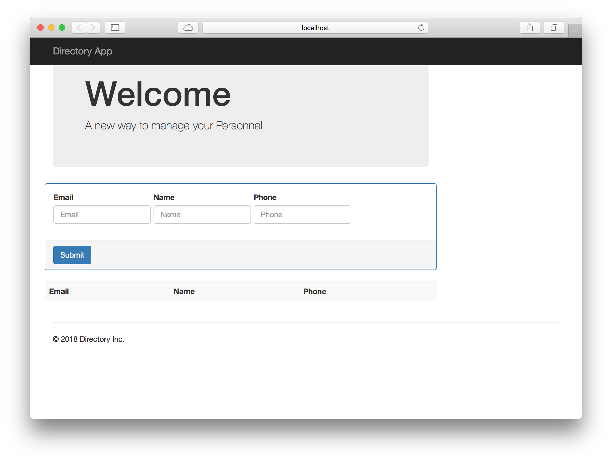
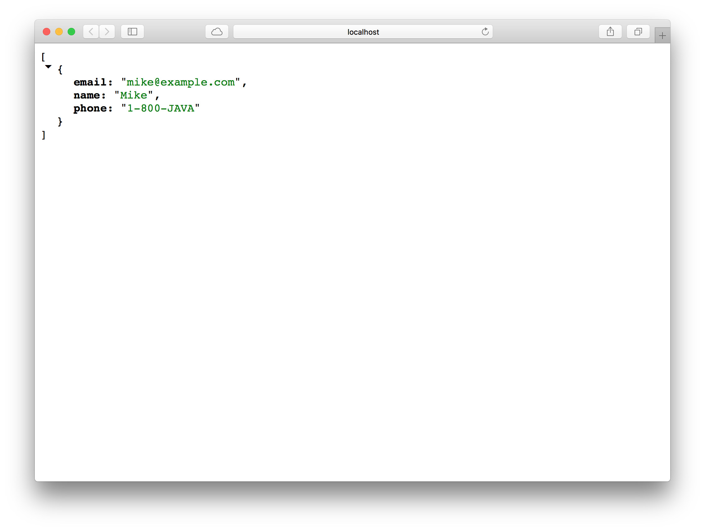
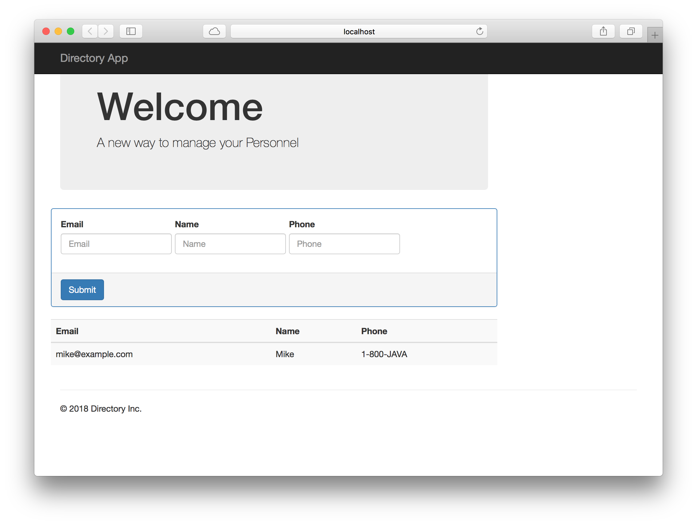

= Deploying Microservices
:docinfo: shared
:toc: macro
:toc-title: Labs
:linkattrs:
:lab: ../labs

The idea of this workshop is to show the differences of using PAS/PKS vs. K8s. This is only for education purpose only.

toc::[]

== Creating Microservices

In this section will cover how to create a complete applicationis from scratch using Java.

=== Directory UI Project

This project will be the Front End that uses a simple form, that will post a JSON to the *_directory-rest_* microservice.

1. Create a project using the Spring Initializr, click https://start.spring.io[,window="_blank"]
2. Use the following information:
+
[cols=">h,5m"]
|===
|Group|io.pivotal.demos
|Artifact|directory-ui
|Dependencies|Web, Lombok, Groovy Templates
|===
+
.Spring Initializr - http://start.spring.io[,window="_blank"]
image:images/directory-ui.png[SpringInitializr, title="Spring Initializr"]
+
TIP: You can choose either Gradle or Maven. 

3. Click *_Generate Project_*, this will download a ZIP file, unzip it wherever you like and import the project in your favorite IDE.

4. Add the following classes:
+
.Person.java
[source,java]
----
include::{lab}/directory-ui/src/main/java/io/pivotal/demos/directoryui/Person.java[]
----
+
This class is the main base model.
+
TIP: The *Person.java* class is using *Lombok*, in order to get all the features, you can install it for your IDE https://projectlombok.org/[here, window="_blank"]
+
.DirectoryProperties.java
[source,java]
----
include::{lab}/directory-ui/src/main/java/io/pivotal/demos/directoryui/DirectoryProperties.java[]
----
+
This class will hold the *directory.service-uri* property that will be used to connect to the *directory-rest* app later on.
+
.DirectoryController.java
[source,java]
----
include::{lab}/directory-ui/src/main/java/io/pivotal/demos/directoryui/DirectoryController.java[]
----
<1> This is the *RestTemplate* utility client class that will be use to call a remote Rest API, in this case the *directory-rest* microservice.
<2> *@GetMapping* marks the method that will get all the incoming request at the */* path. See that this method will return a *ModelAndView* meaning that it will know what view to render (in this case *home*).
<3> Here the *template* instance is using the *getForObject* method that will call the *directory-rest* and it will get back a collection of person objects.
<4> Returns the *ModelAndView* in this case adding the model (*people* result) and the view (*home* page) 
<5> *@PostMapping* marks the method that will receive all the HTTP POSTs that contains a *_JSON_* object, converting it to a *Person* instance.
<6> Here the *template* is sending a POST to the *directory-rest* microservice.
<7> If any exception happen (like no connection or any other exception), this method will catch it and redirect to the home page.
+
.DirectoryConfiguration.java
[source,java]
----
include::{lab}/directory-ui/src/main/java/io/pivotal/demos/directoryui/DirectoryConfiguration.java[]
----
+
This class just enable the properties with the *@EnableConfigurationProperties* tag.

5. In the *src/main/resources/template* folder, create two new directories: *layout* and *views* and add the following files:
+
.src/main/resources/template/layout/main.tpl
[source,groovy]
----
include::{lab}/directory-ui/src/main/resources/templates/layout/main.tpl[]
----
+
This is a *Groovy Template*, that allows to use a *DSL* (Domain Specific Language) using a *MarkupTemplateEngine* logic, less verbose that other engines (In my opinion).
Analyze this file and undestand the syntax.
+
TIP: If you want to know more about the *Groovy Template Engines*, you can get some reference http://docs.groovy-lang.org/docs/next/html/documentation/template-engines.html#_the_markuptemplateengine[here, window="_blank"].
+
.src/main/resources/template/views/home.tpl
[source,groovy]
----
include::{lab}/directory-ui/src/main/resources/templates/views/home.tpl[]
----
+
This is the *home* page. Analyze it and review the syntax. See that here it will collect the information from the *model* (*_people_*) that comes from the *_home()_* method in the *DirectoryController* class.

6. In the *src/main/resources/* folder you will find the *application.properties* file. Modify its contet to look like the following:
+
.src/main/resources/application.properties
[source,properties]
----
include::{lab}/directory-ui/src/main/resources/application.properties[]
----
+
As you can see the *directory.service-uri* property is poiting to the *directory-rest* microservice.

7. Now you can test it. Running in your IDE or using the command line with:
+
[source,shell]
----
./mvnw clean spring-boot:run
----
+
If you go to the http://localhost:8080[^] you will see the following:
+

=== Directory Rest API Project

1. Create a project using the Spring Initializr, click https://start.spring.io[,window="_blank"]
2. Use the following information:
+
[cols=">h,5m"]
|===
|Group|io.pivotal.demos
|Artifact|directory-rest
|Dependencies|Web, Lombok, JPA, H2, MySQL
|===
+
.Spring Initializr - http://start.spring.io[,window="_blank"]
image:images/directory-rest.png[SpringInitializr, title="Spring Initializr"]
+
TIP: You can choose either Gradle or Maven. 

3. Click *_Generate Project_*, this will download a ZIP file, unzip it wherever you like and import the project in your favorite IDE.

4. Add the following classes:
+
.Person.java
[source,java]
----
include::{lab}/directory-rest/src/main/java/io/pivotal/demos/directoryrest/Person.java[]
----
+
This class is the main base model. See that the class is also using *@Entity* and *@Id* annotations that make the class to be persistent into the Database.
+
.PersonRepository.java
[source,java]
----
include::{lab}/directory-rest/src/main/java/io/pivotal/demos/directoryrest/PersonRepository.java[]
----
+
This class extends from the *CrudRepository* interface that uses generics. Is necessary to add the domain class (*Person*) and the *Id* type, in this case a String.
+
.DirectoryController.java
[source,java]
----
include::{lab}/directory-rest/src/main/java/io/pivotal/demos/directoryrest/DirectoryController.java[]
----
+
This class uses the *PersonRepository* instance to access the data. Analyze the class.
+
.DirectoryConfig.java
[source,java]
----
include::{lab}/directory-rest/src/main/java/io/pivotal/demos/directoryrest/DirectoryConfig.java[]
----
+
This is a configuration class where is declaring a *_Spring Bean_*, the *CommandLineRunner* interface that will be execute before the app starts. 
And in this case, the method *init* is using the *PersonRepository* as parameter to save a new *Person*.

5. In the *src/main/resources/static* folder, create a simple *index.html* page:
+
[source,html]
----
include::{lab}/directory-rest/src/main/resources/static/index.html[]
----
+
As you can see there is nothing special about it, just a link to the */persons* endpoint.

6. In the *src/main/resources/* folder you will find the *application.properties* file. Modify its contet to look like the following:
+
.src/main/resources/application.properties
[source,properties]
----
include::{lab}/directory-rest/src/main/resources/application.properties[]
----
+
See that this app will be running in the _port_ *_9090_* and there are two *spring.datasource** related properties that will help to create a table based on the domain class (*Person*).

7. Now you can test it. Running in your IDE or using the command line with:
+
[source,shell]
----
./mvnw clean spring-boot:run
----
+
If you go to the http://localhost:9090/persons[^] you will see the following:
+

8. If you refresh the http://localhost:8080[^] you will see the following:
+

[NOTE]
====
*Congratulations* you just hve creating two microservices and connect them together!!

====

WARNING: But how did the *directory-rest* worked? How the data got persisted?

== Using Pivotal Application Service - PAS

In this section will deploy the two apps and conect them together using Pivotal Application Service.

1. You can get an account in https://run.pivotal.io[PWS, window="_blank"] a PAS offering to the public.
2. Once you have you account, you can login with:
+
.Login into PWS
[source,shell]
----
cf login -a api.run.pivotal.io
----
+ 
Use the account you've just created and your password. By default it use the *_Development_* space.

=== Deploying the Directory UI App

1. Package your app. Go to the *_directory-ui_* project and execute the following command:
+
.Creating an UBER jar
[source,shell]
----
./mvnw clean package -DskipTests
----

2. Deploy the generated *directory-ui-0.0.1-SNAPSHOT.jar* by executing the following command:
+
.Deploying the *directory-ui* app. 
[source,shell]
----
cf push directory-ui --random-route -p target/directory-ui-0.0.1-SNAPSHOT.jar -m 756M
----

=== Deploying the Directory Rest App

1. Deploy the *directory-rest* app by executing the following command:
+
.Deploying the *directory-rest* app.
[source,shell]
----
cf push directory-rest --random-route -p target/directory-rest-0.0.1-SNAPSHOT.jar -m 756M
----
2. Create a the MySQL Service
+
.Creating a Service
[source,shell]
----
cf create-service cleardb spark mysql
----
3. Bind the Service to the *directory-rest* app.
+
.Service binding
[source,shell]
----
cf bind-service directory-rest mysql
----
4. Restage

=== Connecting the Directory UI and Rest

If you go to the *_directory-ui_* app url, you will see that is empty because the *directory.service-uri* still is pointing to the *_localhost:9090_*.
How can we make them talk together. There are several ways:

- You can _hardcode_ the name of the *_directory-rest_* URL and re-deploy it.
- You can use an _Environment Variables_.

Let's use the _Environment Variables_ approach.

1. Add the following environment variable to the *_directory-ui_* app using the following command:
+
.Environment Variables with PCF
[source,shell]
----
cf set-env directory-ui DIRECTORY_SERVICE_URI <directory-rest url with /persons> 
----

2. Restart the app so the environment variable take effect.
+
.Restart App
[source,shell]
----
cf restart directory-ui 
----

3. Now, you can refresh your app and see it working.

== Using Kubernetes

Assuming you have Docker installed in your machine and access to a Kubernetes cluster. You can use https://kubernetes.io/docs/setup/minikube/[minikube, window="_blank"]

=== Creating a Docker image for the Directory UI app

1. Package your app. Go to the *_directory-ui_* project and execute the following command:
+
.Creating an UBER jar
[source,shell]
----
./mvnw clean package -DskipTests
----

2. Create the following *Dockerfile* in the root of the project:
+
.Dockerfile
[source,docker]
----
FROM openjdk:8-jdk-alpine
VOLUME /tmp
COPY target/directory-ui-0.0.1-SNAPSHOT.jar app.jar
EXPOSE 8080
ENTRYPOINT ["java","-Djava.security.egd=file:/dev/./urandom","-jar","/app.jar"]
----

3. Build the Docker image with:
+
.Building the Docker image
[source,shell]
----
docker build -t directory-ui .
----

4. Test the Docker image with:
+
.Testing the Docker image
[source,shell]
----
docker run -d -p 8080:8080 --name directory-ui directory-ui
----
+
Go to the browser to http://localhost:8080[^]
image:images/directory-ui-docker.png[Directory UI with Docker]
+
As you can see there is no people listed. Will fix this later.

5. You can stop and remove the app with:
+
.Removing the Docker image
[source,shell]
----
docker rm -f directory-ui
----

=== Using a Docker image for MySQL

1. Test the image by pulling it from DockerHub
+
.Using the https://hub.docker.com/_/mysql/
[source,shell]
----
docker pull mysql:5.7
----
+
Run the image (this is for testing purposes)
+
[source,shell]
----
docker run -d --name mysql -p 3306:3306 -e MYSQL_ROOT_PASSWORD=pivotal mysql:5.7
----
+
You can test if the MySQL Server is up and running with (assuming you have a *_mysql_* client):
+
[source,shell]
----
mysql --protocol=TCP -ppivotal -uroot

mysql> show databases;
----

=== Creating a Docker image for the Directory Rest app

1. Package your app. Go to the *_directory-ui_* project and execute the following command:
+
.Creating an UBER jar
[source,shell]
----
./mvnw clean package -DskipTests
----

2. Create the following *Dockerfile* in the root of the project:
+
.Dockerfile
[source,docker]
----
FROM openjdk:8-jdk-alpine
VOLUME /tmp
COPY target/directory-rest-0.0.1-SNAPSHOT.jar app.jar
EXPOSE 9090
ENTRYPOINT ["java","-Djava.security.egd=file:/dev/./urandom","-jar","/app.jar"]
----

3. Build the Docker image with:
+
.Building the Docker image
[source,shell]
----
docker build -t directory-rest .
----

4. Test the Docker image with:
+
.Testing the Docker image
[source,shell]
----
docker run -d -p 9090:9090 --name directory-rest directory-rest
----
+
Go to the browser to http://localhost:9090[^] or http://localhost:9090/persons[^]
image:images/directory-rest-docker.png[Directory Rest with Docker]
+
It should be at least one person.

5. You can stop and remove the app with:
+
.Removing the Docker image
[source,shell]
----
docker rm -f directory-ui
----

=== Using *kubectl* to Deploy the Apps to Kubernetes

1. Create and run a *MYSQL* pod:
+
.mysql-pod.json
[source,yaml]
----
apiVersion: v1
kind: Pod
metadata:
  name: mysql
  labels:
    name: mysql
spec:
  containers: 
    - name: mysql
      image: mysql:5.7
      imagePullPolicy: Never
      env: 
        - name: "MYSQL_ROOT_PASSWORD"
          value: "pivotal"
      ports: 
        - containerPort: 3306
----
+
Create the POD
+
[source,shell]
----
kubectl create -f mysql-pod.json
----
+
Verify is running
+
[source,shell]
----
kubectl get pod/mysql
----

2. Create the *_testdb_* database by exposing the MySQL so it can be accesible.
+
[source,shell]
----
kubectl exec -it mysql bash

root@mysql:/# mysql -ppivotal

mysql> create database testdb;
----

3. Expose the *MySQL* as Service:
+
.mysql-service.json
[source,shell]
----
kind: Service
apiVersion: v1
metadata:
  name: mysql
spec:
  selector:
    app: mysql
  ports:
  - protocol: TCP
    port: 3306
    targetPort: 3306
----
Create the Service
+
[source,shell]
----
kubectl create -f mysql-service.json
----
+
Verify is running
+
[source,shell]
----
kubectl get services/mysql
----

4. Create the *directory-rest* pod:
+
.directory-rest-pod.json
[source,yaml]
----
apiVersion: v1
kind: Pod
metadata:
  name: directory-rest
  labels:
    name: directory-rest
spec:
  containers: 
    - name: directory-rest
      image: directory-rest
      imagePullPolicy: Never
      env: 
        - name: "SPRING_DATASOURCE_USERNAME"
          value: "root"
        - name: "SPRING_DATASOURCE_PASSWORD"
          value: "pivotal"
        - name: "SPRING_DATASOURCE_DRIVER_CLASS_NAME"
          value: "com.mysql.jdbc.Driver"
        - name: "SPRING_DATASOURCE_URL"
          value: "jdbc:mysql://mysql:3306/testdb?autoReconnect=true&useSSL=false"
      ports: 
        - containerPort: 9090
----
+
Create the POD
+
[source,shell]
----
kubectl create -f directory-rest-pod.json
----

5. Expose the *directory-rest* as a Service:
+
.directory-rest-service.json
[source,yaml]
----
kind: Service
apiVersion: v1
metadata:
  name: directory-rest
spec:
  selector:
    app: directory-rest
  ports:
  - protocol: TCP
    port: 9090
    targetPort: 9090
----
+
Create the Service
+
[source,shell]
----
kubectl create -f directory-rest-service.json
----

6. Create the *directory-ui* pod:
+
.directory-rest-pod.json
[source,yaml]
----
apiVersion: v1
kind: Pod
metadata:
  name: directory-ui
  labels:
    name: directory-ui
spec:
  containers: 
    - name: directory-ui
      image: directory-ui
      imagePullPolicy: Never
      env: 
        - name: "DIRECTORY_SERVICE_URI"
          value: "http://directory-rest:9090/persons"
      ports: 
        - containerPort: 8080
----
+
Create the POD
+
[source,shell]
----
kubectl create -f directory-ui-pod.json
----

7. Expose/Access the *directory-ui* app

